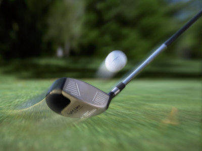
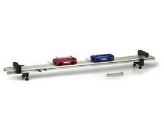
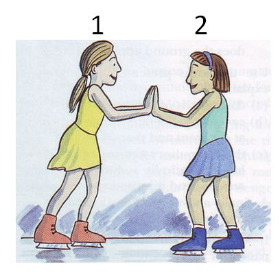
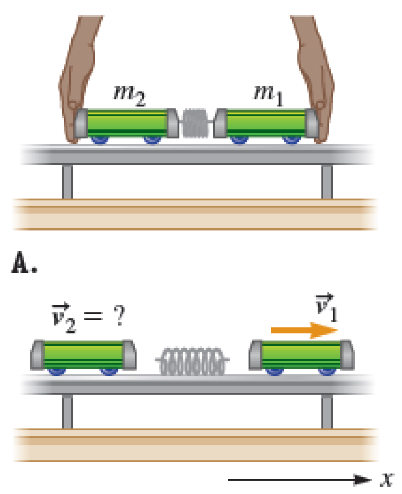

#+title: Opgaver til impuls og stød
#+subtitle: Translatorisk mekanik
#+author: Jacob Debel
#+date: Fysik A (Fysik B)
#+latex_class: article
#+latex_class_options: [a4paper, 12pt]
#+language: da
#+latex_header: \usepackage[danish]{babel}
#+latex_header: \usepackage[margin=3.0cm]{geometry}
#+latex_header: \usepackage{hyperref}
#+latex_header: \hypersetup{colorlinks, linkcolor=black, urlcolor=blue}
#+latex_header_extra: \setlength{\parindent}{0em}
#+latex_header_extra: \parskip 1.5ex
#+options: ^:{} tags:nil toc:nil num:nil # Only for org export
# #+toc: t # For pandoc export
# #+numbersections: t # For pandoc export

* Opgave 1                                                              :381:
En kraft på 50 N påvirker et objekt på 20 kg i 4 s. Derved standses objektet.

1. Bestem objektets impulsændring.
2. Bestem objektets oprindelige hastighed.

* Opgave 2                                                              :382:
  

#+attr_html: :width 600px
#+attr_latex: :width 7cm :float wrap :placement {r}{7cm}

En 850 kg tung bil støder ind i et vejtræ med en hastighed på 40 km/h. Ved sammenstødet, som tager 0.15 s, deformeres bilens stødzone foran.

1. Bestem gennemsnitskraften på bilen.
2. Bestem gennemsnitsaccelerationen.
3. Bestem bilens deformation.
   
\newpage

* Opgave 3                                                              :383:

#+attr_html: :width 600px
#+attr_latex: :width 7cm 

En golfkugle opnår hastigheden 100 km/h ved et slag, som tager 2/100 s.
1. Bestem kraftpåvirkningen af den 150 g tunge golfkugle.

* Opgave 4                                                              :384:

#+attr_html: :width 600px
#+attr_latex: :width 10cm

Med et hammerslag bankes et søm ind i et stykke træ. Hammerens hoved vejer 500 g, og anslaget sker med en hastighed på 3.8 m/s, og tager 3/100 s.

1. Bestem impulsændringen af hammerhovedet.
2. Bestem den kraft hammeren påvirker sømmet med.
3. Bestem hvor langt sømmet slås ind.

* Opgave 5                                                              :385:
#+attr_html: :width 600px
#+attr_latex: :width 10cm

Et projektil på 20 g affyres af en pistol, som vejer 0.87 kg. Pistolløbet er 10 cm langt, og mundingshastigheden er 600 m/s. Pistolen holdes fast under skuddet.

1. Bestem pistolens rekylhastighed.
2. Bestem projektilets gennemsnitsacceleration.
3. Bestem rekylkraften, altså kraftpåvirkningen på pistolen.
4. Bestem gennemsnitskraften taget over 1/10 s.

* Opgave 6                                                              :386:
#+attr_html: :width 600px
#+attr_latex: :width 7cm 

En vogn med massen 300 g er i hvile, og en anden vogn med massen 430 g støder totalt uelastisk ind i denne. Vognen i bevægelse har hastigheden 2.73 m/s.

1. Bestem hastigheden efter stødet.
2. Bestem hastighederne af hver vogn efter stødet, hvis dette havde været 100% elastisk.
   
\newpage
   
* Opgave 7                                                              :387:
   En af de store farer for Jorden er kometer og meteorer. Eksempelvis kan en komet med en masse på $50 \cdot 10^9$ kg risikere at ramme Jorden med en hastighed på 40 km/s relativt til Jorden.

1. Bestem hastigheden af Jorden efter stødet i forhold til Jordens bane umiddelbart før stødet.
2. Bestem tabet i mekanisk energi.
3. Bestem hvor mange atombomber meteornedslaget svarer til. Antag af hver atombombe har en springkraft på 10 Megaton ($5.066 \cdot 10^{16} J$).

* Opgave 8                                                         :388:svær:
#+attr_html: :width 600px
#+attr_latex: :width 7cm 

To vogne med masser på henholdsvis 240 g og 462 g bevæger sig mod hinanden med hastigheder på henholdsvis 3.40 m/s og 4.28 m/s.

1. Bestem hastigheden efter stødet, såfremt dette er totalt uelastisk.
2. Bestem hastighederne efter stødet, såfremt dette havde været 100% elastisk.

* Opgave 9                                                              :389:
#+attr_html: :width 600px
#+attr_latex: :width 7cm 

To skøjteløbere, der tilsammen vejer 120 kg, står over for hinanden, og puffer til hinanden, så de bevæger sig fra hinanden med hastigheder på 3.3 m/s og 2.1 m/s.
1. Bestem de to skøjteløberes individuelle vægte.
   
   
* Opgave 10                                                             :390:
En træklods med massen 0.85 kg ligger i hvile på et vandret underlag, hvor friktionskoefficienten er $\mu = 0.25$. Et projektil, med massen 5 g skydes ind i træklodsen vandret, hvor det sætter sig fast. Træklodsen bevæger sig herefter 2.0 m, før den går i stå igen.
1. Bestem klodsens hastighed, lige efter projektilet har boret sig fast.
2. Bestem projektilets hastighed umiddelbart før det rammer træklodsen.
3. Bestem tabet i mekanisk energi i procent fra før projektilet rammer klodsen, til lige i det øjeblik, hvor projektilet har sat sig fast i klodsen.
   
\newpage

* Opgave 11                                                             :391:
#+attr_html: :width 600px
#+attr_latex: :width 7cm 

En fjeder med fjederkonstanten 650 N/m presses ind mellem to vogne, således at dens deformation er 4.2 cm. Vognenes masser er henholdsvis 2.7 kg og 4.82 kg.
1. Bestem hastighederne efter at fjederen er udløst.

* Opgave 12                                                             :392:
Et projektil på 17 g skydes ind i en 3.96 kg tung sandsæk. Sandsækken er ophængt i en 2 m lang snor, og gør ved skuddet et udsving på $37^{\circ}$ med lodret.

1. Bestem hastigheden af sandsækken umiddelbart efter at projektilet har sat sig fast.
2. Bestem projektilets hastighed umiddelbart før det ramte sandsækken.

* Opgave 13                                                             :394:
En satellit på ialt 500 kg er udstyret med en brændstoftank på 50 kg. Ved forbrænding af brændstoffet slynges dette bagud gennem dyser med en hastighed på 4500 m/s.
1. Beregn den hastighedsændring, som brændstoffet kan give satellitten, når denne befinder sig i det fri rum.
   
* Opgave 14                                                             :395:
En 70 kg tung kugle med en diameter på 50 cm forbindes til enden af en 30 kg tung homogen bjælke med med en længde på 1.3 m.

1. Indlæg et passende koordinatsystem og angiv massemidtpunkterne af kuglen og bjælken.
2. Bestem beliggenheden af systemets massemidtpunkt.
   
* Opgave 15                                                             :396:
Tre stænger med ensartert tværsnit og massefylde svejses sammen til en trekant med sidelængder 1.5 m, 2 m og 2.5 m.
1. Beregn beliggenheden af trekantens massemidtpunkt.

* Facitliste

- *Opgave 1:* 1) 200 Ns 2) 10 m/s
- *Opgave 2:* 1) 62.96 kN 2) $74 m/s^2$ 3) 0.83 m
- *Opgave 3:* 1) 208 N
- *Opgave 4:* 1) $1.9 \frac{kg \cdot m}{s}$ 2) 63.3 N 3) 5.7 cm
- *Opgave 5:* 1) 13.8 m/s 2) $1.8 \cdot 10^6 m/s^2$ 3) 36 kN 4) 120 N
- *Opgave 6:* 1) 1.61 m/s 2) 3.22 m/s og 0.486 m/s
- *Opgave 7:* 1) 0.335 nm/s 2) $4.0\cdot 10^{19} J$ 3) 790
- *Opgave 8:* 1) -1.65 m/s 2)-6.78 m/s og 1.01 m/s
- *Opgave 9:* 1) 73.3 kg og 46.7 kg
- *Opgave 10:* 1) 3.13 m/s 2) 533 m/s 3) 99.4%
- *Opgave 11:* 1) -0.52 m/s og 0.29 m/s
- *Opgave 12:* 1) 2.81 m/s 2) 654 m/s
- *Opgave 13:* 1) 474 m/s
- *Opgave 14:* 1) ikke noget facit 2) 0.27 m fra kuglens centrum.
- *Opgave 15:* 1) x= 0.75 m og y=0.5 m (afhænger af placeringen af stængerne i koordinatsystemet).

